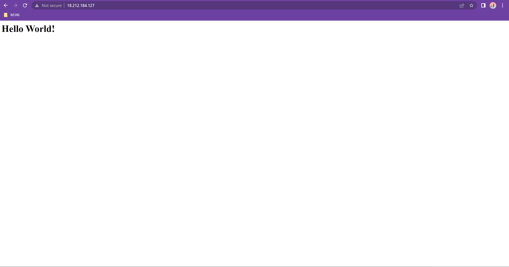

## 4.1

Die webseite die ich erstellt habe.


die details von der EC2 instanz.


## 4.2


die webseite die ich erstellt habe.


object list


static website hosting


liste meiner buckets

## 4.2 B.

mit mischa-1.ppk


mit mischa-2.ppk


die server instanz

## 4.2. C.
```yaml
#cloud-config
users:
  - name: ubuntu # hier muss der username stehen
    sudo: ALL=(ALL) NOPASSWD:ALL # sudo rechte
    groups: users, admin # gruppen
    home: /home/ubuntu # home verzeichnis
    shell: /bin/bash # shell umgebung
    ssh_authorized_keys: # ssh key
      - ssh-rsa AAAAB3NzaC1yc2EAAAADAQABAAABAQCDGcmXkASrKt0UGSJzu8jfq3ObuBO9j/UW
wZ0AaERurceA8DfI63Jlh3Nmm9t7KN31HiT38ZjmdjKTe7yEUDrKPXwegql8qv0N
QWiN938Tpu7d6+Fe9GxT6ZyId2EBzkJ4oAB6aoPhi2nFEa83Mjvu4F7Y6OrVuhjG
MGU5AjiLG5eGS8+gyy6dryjG+txamreP82BR9PtMhkvgvOqpWJk/nOKZnp5YmTFe
7F1GkezdTXFFiUfDCvlvMtQVK+At51R/d5o5Dfy8g1VE3iB3Q4kB8gBrVLFjxlLN
6q2TsBz0AfKsMNdtqYEgDJPlfoOn+pVznPhwFruQ81mTNaNIsb0X aws-key # hier muss der ssh key stehen
ssh_pwauth: false # ssh passwort authentifizierung
disable_root: false # root login
package_update: true # pakete updaten
packages: # pakete
  - curl # curl paket
  - wget  # wget paket

```


Mit mischa-2.ppk successful


Mit mischa-1.ppk failed


Die Instanz mit dem verwendeten Key