## cloud-init-db.yaml
```yaml
#cloud-config
users: # alle User
  - name: ubuntu # default user's name
    sudo: ALL=(ALL) NOPASSWD:ALL # sudo regeln
    groups: users, admin # gruppen vom User
    home: /home/ubuntu # home-verzeichnis
    shell: /bin/bash # default shell verzeichnis
    ssh_authorized_keys:
     - ssh-rsa AAAAB3NzaC1yc2EAAAADAQABAAABAQCDGcmXkASrKt0UGSJzu8jfq3ObuBO9j/UWwZ0AaERurceA8DfI63Jlh3Nmm9t7KN31HiT38ZjmdjKTe7yEUDrKPXwegql8qv0NQWiN938Tpu7d6+Fe9GxT6ZyId2EBzkJ4oAB6aoPhi2nFEa83Mjvu4F7Y6OrVuhjGMGU5AjiLG5eGS8+gyy6dryjG+txamreP82BR9PtMhkvgvOqpWJk/nOKZnp5YmTFe7F1GkezdTXFFiUfDCvlvMtQVK+At51R/d5o5Dfy8g1VE3iB3Q4kB8gBrVLFjxlLN6q2TsBz0AfKsMNdtqYEgDJPlfoOn+pVznPhwFruQ81mTNaNIsb0X aws-key
ssh_pwauth: false
disable_root: false
package_update: true
packages:
  - mariadb-server
  - php-mysqli

runcmd:
 - sudo mysql -sfu root -e "GRANT ALL ON *.* TO 'admin'@'%' IDENTIFIED BY 'password' WITH GRANT OPTION;"
 - sudo sed -i 's/127.0.0.1/0.0.0.0/g' /etc/mysql/mariadb.conf.d/50-server.cnf
 - sudo systemctl restart mariadb.service
```

## cloud-init-web.yaml
```yaml
#cloud-config
users: # alle User
  - name: ubuntu # default user's name
    sudo: ALL=(ALL) NOPASSWD:ALL # sudo regeln
    groups: users, admin # gruppen vom User
    home: /home/ubuntu # home-verzeichnis
    shell: /bin/bash # default shell verzeichnis
    ssh_authorized_keys: # liste erlaubte ssh-keys
      - ssh-rsa AAAAB3NzaC1yc2EAAAADAQABAAABAQCDGcmXkASrKt0UGSJzu8jfq3ObuBO9j/UWwZ0AaERurceA8DfI63Jlh3Nmm9t7KN31HiT38ZjmdjKTe7yEUDrKPXwegql8qv0NQWiN938Tpu7d6+Fe9GxT6ZyId2EBzkJ4oAB6aoPhi2nFEa83Mjvu4F7Y6OrVuhjGMGU5AjiLG5eGS8+gyy6dryjG+txamreP82BR9PtMhkvgvOqpWJk/nOKZnp5YmTFe7F1GkezdTXFFiUfDCvlvMtQVK+At51R/d5o5Dfy8g1VE3iB3Q4kB8gBrVLFjxlLN6q2TsBz0AfKsMNdtqYEgDJPlfoOn+pVznPhwFruQ81mTNaNIsb0X aws-key # shh-key
ssh_pwauth: false # shh-password authentizierung
disable_root: false  # gibt es root-login
package_update: true # packete beim start updaten
package_upgrade: true
packages: # liste von zu instalierenden paketen
  - apache2
  - php
  - libapache2-mod-php
  - php-mysqli
  - adminer
runcmd:
  - sudo a2enconf adminer
  - sudo systemctl restart apache2
write_files:
 - encoding: b64
   content: PD9waHAKICAgICAgICAvL2RhdGFiYXNlCiAgICAgICAgJHNlcnZlcm5hbWUgPSAiMTcyLjMxLjEwMC4zMSI7CiAgICAgICAgJHVzZXJuYW1lID0gImFkbWluIjsKICAgICAgICAkcGFzc3dvcmQgPSAicGFzc3dvcmQiOwogICAgICAgICRkYm5hbWUgPSAibXlzcWwiOwoKICAgICAgICAvLyBDcmVhdGUgY29ubmVjdGlvbgogICAgICAgICRjb25uID0gbmV3IG15c3FsaSgkc2VydmVybmFtZSwgJHVzZXJuYW1lLCAkcGFzc3dvcmQsICRkYm5hbWUpOwogICAgICAgIC8vIENoZWNrIGNvbm5lY3Rpb24KICAgICAgICBpZiAoJGNvbm4tPmNvbm5lY3RfZXJyb3IpIHsKICAgICAgICAgICAgICAgIGRpZSgiQ29ubmVjdGlvbiBmYWlsZWQ6ICIgLiAkY29ubi0+Y29ubmVjdF9lcnJvcik7CiAgICAgICAgfQoKICAgICAgICAkc3FsID0gInNlbGVjdCBIb3N0LCBVc2VyIGZyb20gbXlzcWwudXNlcjsiOwogICAgICAgICRyZXN1bHQgPSAkY29ubi0+cXVlcnkoJHNxbCk7CiAgICAgICAgd2hpbGUoJHJvdyA9ICRyZXN1bHQtPmZldGNoX2Fzc29jKCkpewogICAgICAgICAgICAgICAgZWNobygkcm93WyJIb3N0Il0gLiAiIC8gIiAuICRyb3dbIlVzZXIiXSAuICI8YnIgLz4iKTsKICAgICAgICB9CiAgICAgICAgLy92YXJfZHVtcCgkcmVzdWx0KTsKPz4K
   path: /var/www/html/db.php

 - encoding: b64
   content: PD9waHAKICAgICAgICAvLyBTaG93IGFsbCBpbmZvcm1hdGlvbiwgZGVmYXVsdHMgdG8gSU5GT19BTEwKICAgICAgICBwaHBpbmZvKCk7CiAgICA/Pg==
   path: /var/www/html/info.php
```


### beweisfuehrung
**cloud-init-db.yaml**
1. mysql -u admin -p
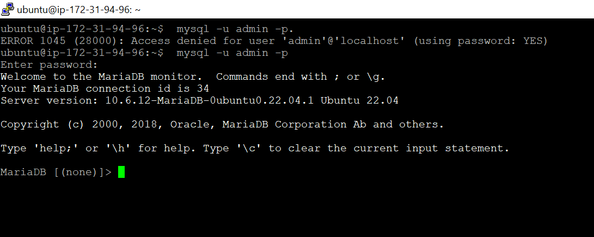
2. connection with telnet
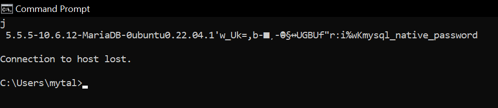

**cloud-init-web.yaml**
1. sites:
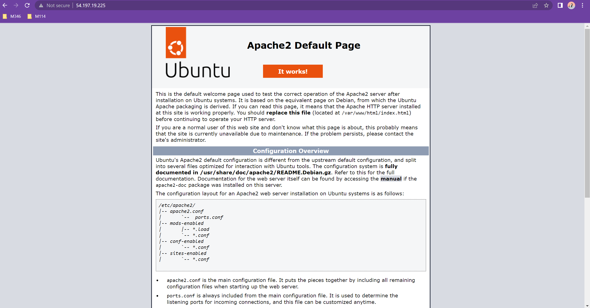
index.html
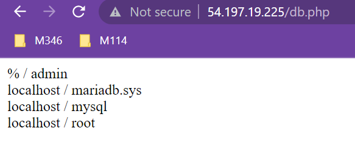
db.php
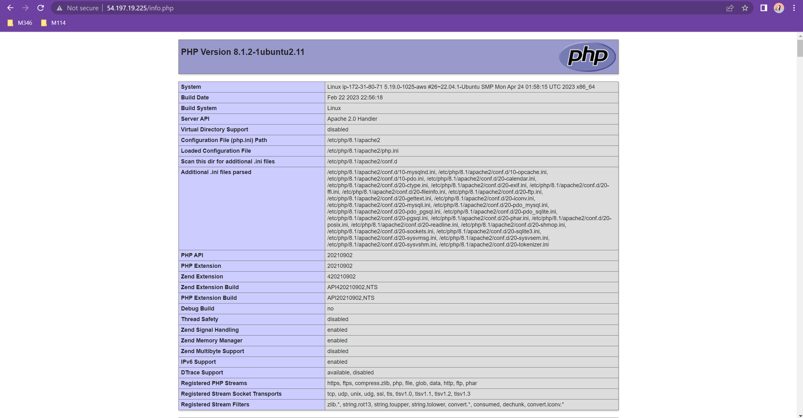
info.php

2. adminer
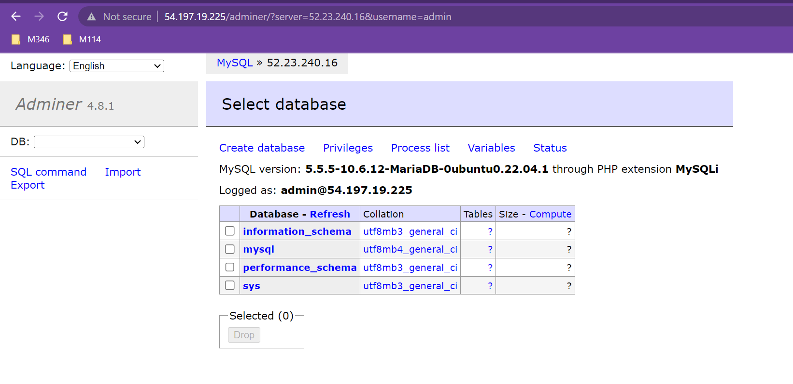

# B
1. S3 (Simple Storage Service) ist ein Speicherdienst von Amazon Web Services (AWS), der als Objektspeichermodell klassifiziert wird.

hot storage:
Daten werden schnell zugreifbar gespeichert (oft auf SSD)

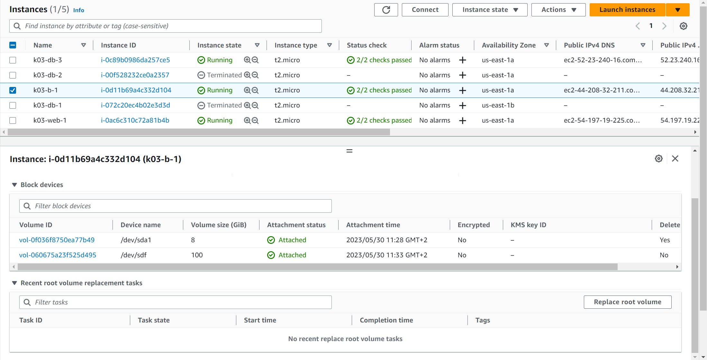
zweite volume

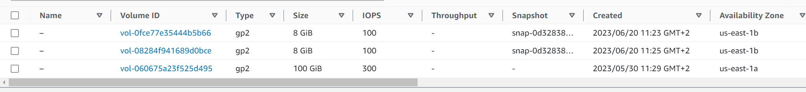
Die EB-Storages.

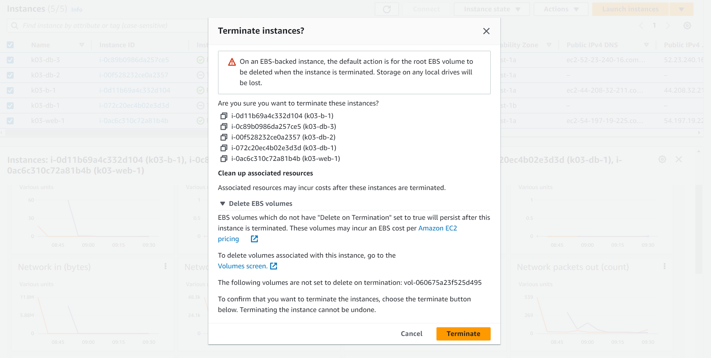
die EBS volumes mit "Delete on Termination" werden auch gelöscht.
das heisst das volume, das wir erstellt haben werden nach terminiertung von der EC2 instanzen nich gelöscht.

2. 

---

## B zum Teil nochmal, weil oben unvollständig

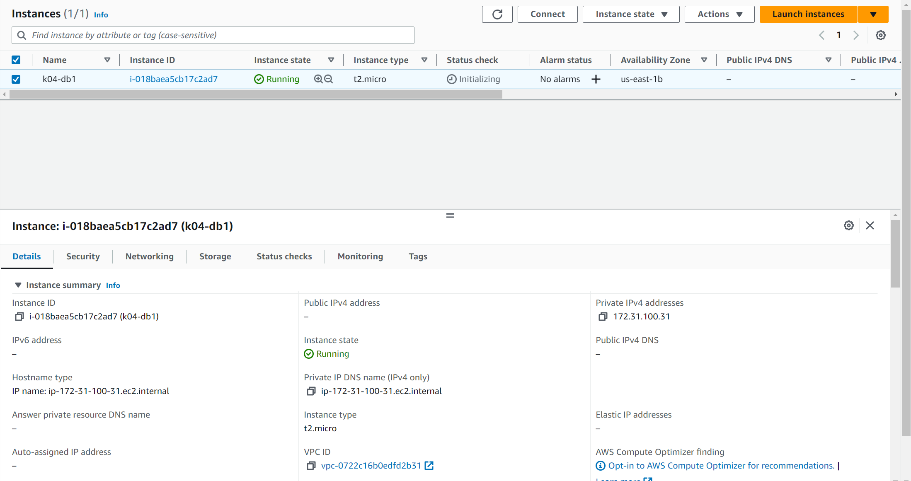
Instanz vor dem Löschen

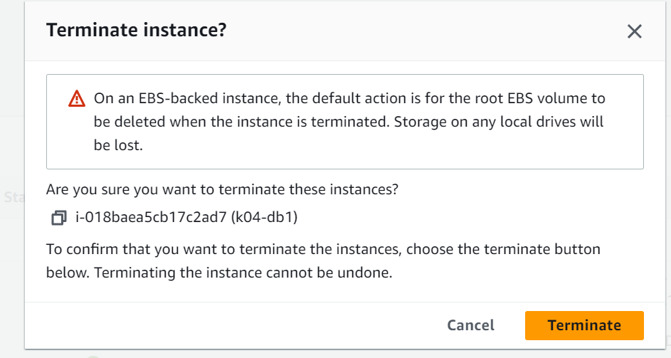
Instanz die Warnung beim löschen.

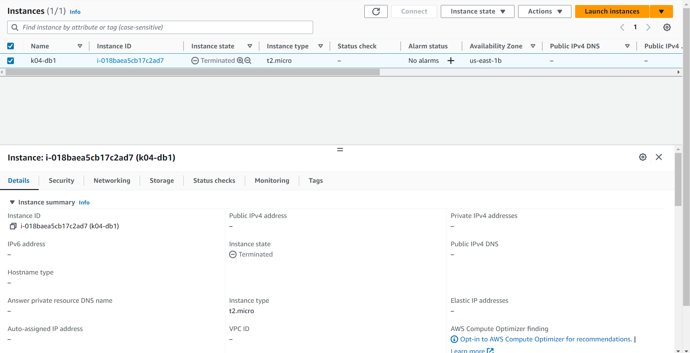
Die Instanz wurde terminiert.
Das Volume wurde nicht gelöscht. Weil wir "Delete on Termination" nicht aktiviert haben.
