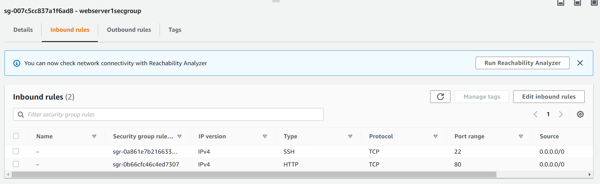
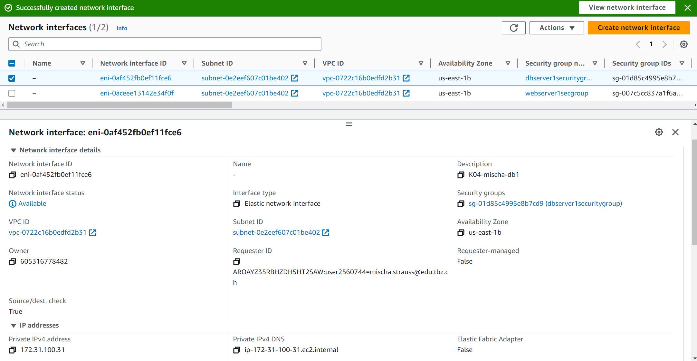

my subnet :D

## elastic ip's


## Security groups

liste von den security groups


web server security group


db server security group

## network interfaces

web

db


### web

die inbound rules sind für die web server security group

### db

die inbound rules sind für die db server security group

### info.php

info.php page

### index.html

index.html page

### db.php

db.php page

## Instanzen

k04-db-1


k04-web-1


cloud-init-db.yml
```yml
#cloud-config
users:
  - name: ubuntu
    sudo: ALL=(ALL) NOPASSWD:ALL
    groups: users, admin
    home: /home/ubuntu
    shell: /bin/bash
    ssh_authorized_keys:
      - ssh-rsa AAAAB3NzaC1yc2EAAAADAQABAAABAQCDGcmXkASrKt0UGSJzu8jfq3ObuBO9j/UWwZ0AaERurceA8DfI63Jlh3Nmm9t7KN31HiT38ZjmdjKTe7yEUDrKPXwegql8qv0NQWiN938Tpu7d6+Fe9GxT6ZyId2EBzkJ4oAB6aoPhi2nFEa83Mjvu4F7Y6OrVuhjGMGU5AjiLG5eGS8+gyy6dryjG+txamreP82BR9PtMhkvgvOqpWJk/nOKZnp5YmTFe7F1GkezdTXFFiUfDCvlvMtQVK+At51R/d5o5Dfy8g1VE3iB3Q4kB8gBrVLFjxlLN6q2TsBz0AfKsMNdtqYEgDJPlfoOn+pVznPhwFruQ81mTNaNIsb0X aws-key
ssh_pwauth: false
disable_root: false
package_update: true
packages:
  - mariadb-server
  - php-mysqli

runcmd:
 - sudo mysql -sfu root -e "GRANT ALL ON *.* TO 'admin'@'%' IDENTIFIED BY 'password' WITH GRANT OPTION;"
 - sudo sed -i 's/127.0.0.1/0.0.0.0/g' /etc/mysql/mariadb.conf.d/50-server.cnf
 - sudo systemctl restart mariadb.service
 ```

cloud-init-web.yml
```yml
#cloud-config
users: # alle User
  - name: ubuntu 
    sudo: ALL=(ALL) NOPASSWD:ALL
    groups: users, admin
    home: /home/ubuntu 
    shell: /bin/bash 
    ssh_authorized_keys:
      - ssh-rsa AAAAB3NzaC1yc2EAAAADAQABAAABAQCDGcmXkASrKt0UGSJzu8jfq3ObuBO9j/UWwZ0AaERurceA8DfI63Jlh3Nmm9t7KN31HiT38ZjmdjKTe7yEUDrKPXwegql8qv0NQWiN938Tpu7d6+Fe9GxT6ZyId2EBzkJ4oAB6aoPhi2nFEa83Mjvu4F7Y6OrVuhjGMGU5AjiLG5eGS8+gyy6dryjG+txamreP82BR9PtMhkvgvOqpWJk/nOKZnp5YmTFe7F1GkezdTXFFiUfDCvlvMtQVK+At51R/d5o5Dfy8g1VE3iB3Q4kB8gBrVLFjxlLN6q2TsBz0AfKsMNdtqYEgDJPlfoOn+pVznPhwFruQ81mTNaNIsb0X aws-key 
ssh_pwauth: false 
disable_root: false 
package_update: true
package_upgrade: true
packages:
  - apache2
  - php
  - libapache2-mod-php
  - php-mysqli
  - adminer

write_files:
 - encoding: b64
   content: PD9waHAKICAgICAgICAvL2RhdGFiYXNlCiAgICAgICAgJHNlcnZlcm5hbWUgPSAiMTcyLjMxLjEwMC4zMSI7CiAgICAgICAgJHVzZXJuYW1lID0gImFkbWluIjsKICAgICAgICAkcGFzc3dvcmQgPSAicGFzc3dvcmQiOwogICAgICAgICRkYm5hbWUgPSAibXlzcWwiOwoKICAgICAgICAvLyBDcmVhdGUgY29ubmVjdGlvbgogICAgICAgICRjb25uID0gbmV3IG15c3FsaSgkc2VydmVybmFtZSwgJHVzZXJuYW1lLCAkcGFzc3dvcmQsICRkYm5hbWUpOwogICAgICAgIC8vIENoZWNrIGNvbm5lY3Rpb24KICAgICAgICBpZiAoJGNvbm4tPmNvbm5lY3RfZXJyb3IpIHsKICAgICAgICAgICAgICAgIGRpZSgiQ29ubmVjdGlvbiBmYWlsZWQ6ICIgLiAkY29ubi0+Y29ubmVjdF9lcnJvcik7CiAgICAgICAgfQoKICAgICAgICAkc3FsID0gInNlbGVjdCBIb3N0LCBVc2VyIGZyb20gbXlzcWwudXNlcjsiOwogICAgICAgICRyZXN1bHQgPSAkY29ubi0+cXVlcnkoJHNxbCk7CiAgICAgICAgd2hpbGUoJHJvdyA9ICRyZXN1bHQtPmZldGNoX2Fzc29jKCkpewogICAgICAgICAgICAgICAgZWNobygkcm93WyJIb3N0Il0gLiAiIC8gIiAuICRyb3dbIlVzZXIiXSAuICI8YnIgLz4iKTsKICAgICAgICB9CiAgICAgICAgLy92YXJfZHVtcCgkcmVzdWx0KTsKPz4K
   path: /var/www/html/db.php

 - encoding: b64 
   content: PD9waHAKICAgICAgICAvLyBTaG93IGFsbCBpbmZvcm1hdGlvbiwgZGVmYXVsdHMgdG8gSU5GT19BTEwKICAgICAgICBwaHBpbmZvKCk7CiAgICA/Pg==
   path: /var/www/html/info.php

runcmd:
 - sudo a2enconf adminer
 - sudo systemctl restart apache2
 ```
